## Типы штрих кодов для классификации

### Одномерные:

#### Generic 1d barcode
имя для разметки: **"generic1d"** 
Если вы не можете определить тип одномерного кода, проставьте этот тип. Это пока неизвестный тип одномерного кода.
Рекомендую использовать только в **крайних случаях**, ибо потом все равно придется определять тип кода.

#### Code-39
имя для разметки: **"code_39"**  
Одномерный штрихкод, который поддерживает цифры, буквы латинского алфавита и несколько специальных символов. Используется в логистике и маркировке товаров и пропусков.

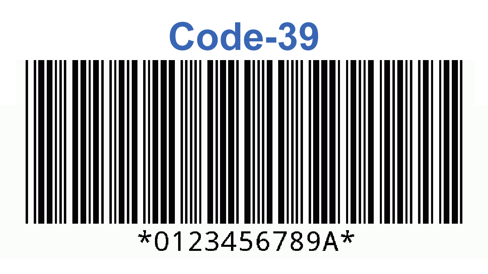

Соотношение сторон может варьироваться, но обычно составляет около 3:1 между шириной и высотой.

#### EAN-8
имя для разметки: **"ean_8"**  
Компактный вариант EAN-13, содержащий 8 цифр. Применяется для маркировки небольших товаров, на которых нет места для более длинных штрихкодов.

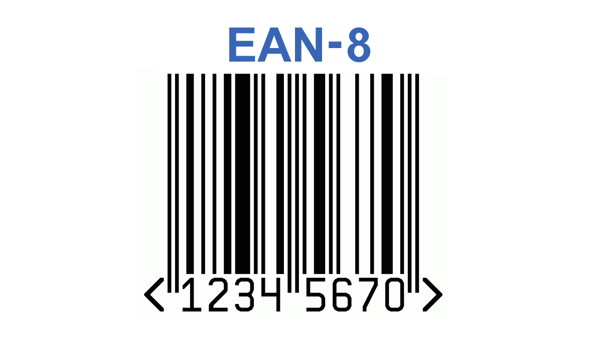

Стандартный размер EAN-8 имеет фиксированную пропорцию ширины к высоте, которая обычно составляет 73.42% по ширине к высоте (т.е., ширина примерно на 30% меньше высоты).

#### EAN-13
имя для разметки: **"ean_13"**  
Наиболее распространенный штрихкод в мире, состоящий из 13 цифр. Используется для маркировки розничных товаров и отслеживания в системах логистики.

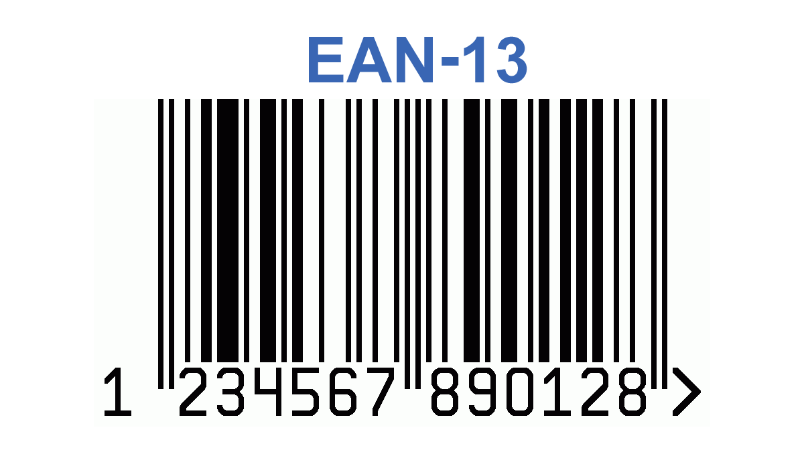

Как и EAN-8, имеет фиксированную пропорцию, соотношение ширины к высоте обычно около 73.42%.

#### EAN-128
имя для разметки: **"ean_128"**  
Расширенный вариант стандартов EAN, содержащий больше информации, включая символы ASCII. Подходит для использования в транспортировке и логистике.

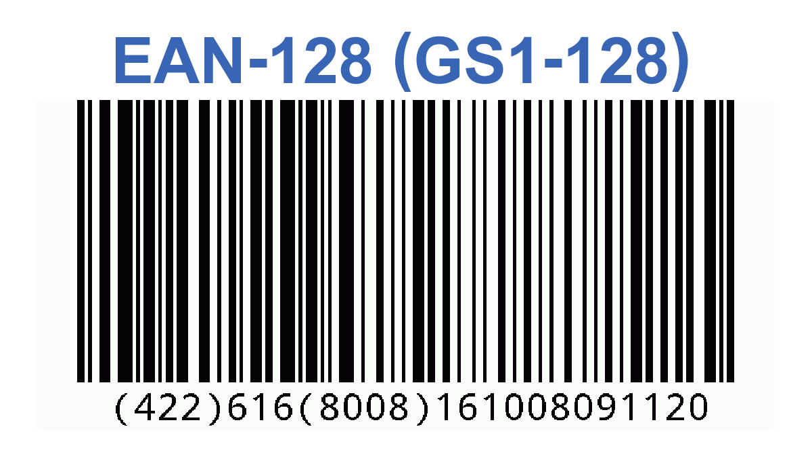

Зависит от количества закодированных данных, но обычно соотношение сторон соответствует традиционным вертикально ориентированным штрихкодам.

#### Interleaved 2 of 5
имя для разметки: **"interleaved_2_of_5"**  
Одномерный штрихкод, числовой, где цифры закодированы попарно, что обеспечивает высокую плотность данных. Широко используется в складских системах и инвентаризации.

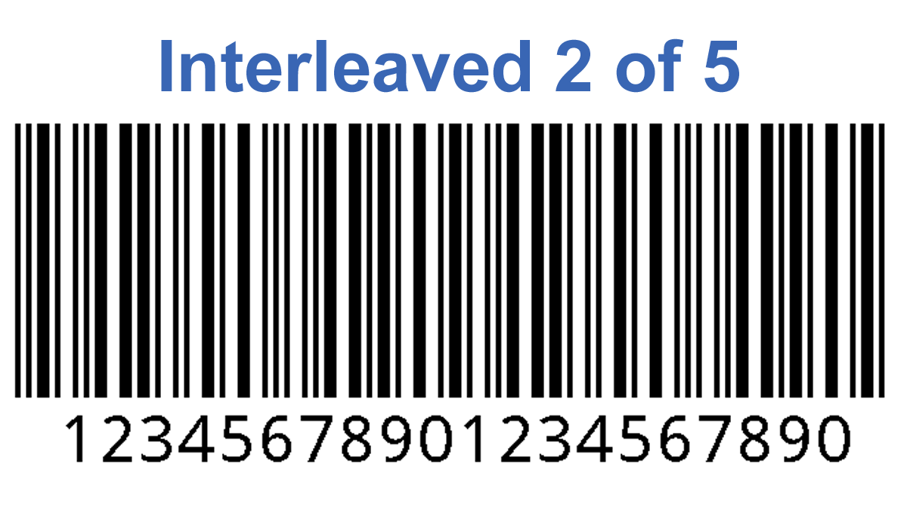

Соотношение может варьироваться в зависимости от количества данных, обычно ширина штрихов к пробелам составляет 3:1.

#### UPC-A
имя для разметки: **"upc_a"**  
Распространенный в Северной Америке штрихкод, состоящий из 12 цифр. Используется для идентификации товаров в розничной торговле.

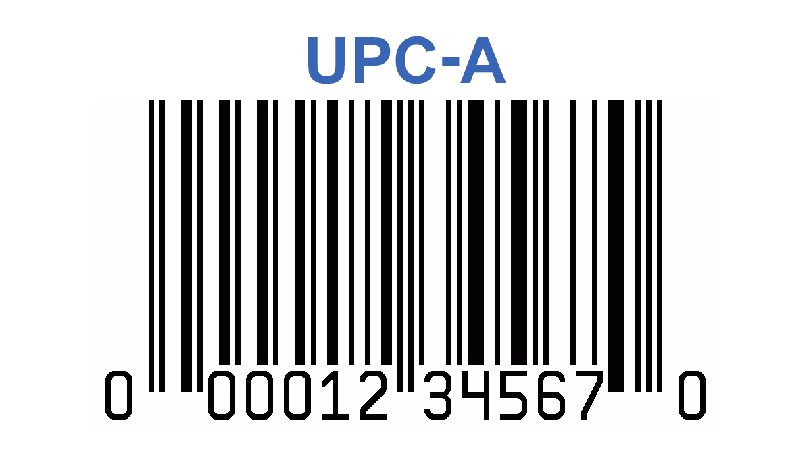

Имеет фиксированное соотношение, как правило, около 73.42%.

#### UPC-E
имя для разметки: **"upc_e"**  
Компактная версия UPC-A, предназначенная для упаковки малого размера, где необходимо сократить длину штрихкода.

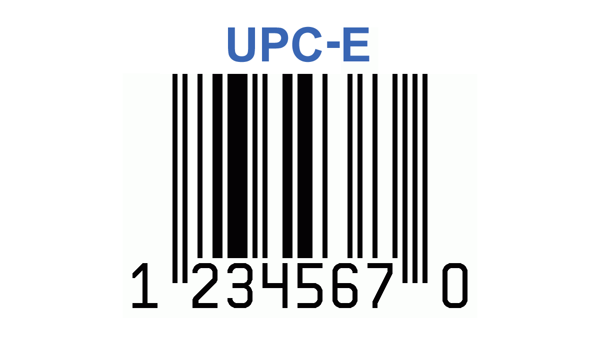

Сжаленный вариант UPC-A, также сохраняет пропорцию около 73.42%.

### Двумерные:

#### Generic 2d barcode
имя для разметки: **"generic2d"** 
Если вы не можете определить тип двумерного кода, проставьте этот тип. Это пока неизвестный тип двумерного кода.
Рекомендую использовать только в **крайних случаях**, ибо потом все равно придется определять тип кода.

#### Aztec Code
имя для разметки: **"aztec_code"**  
Двумерный штрихкод, способный кодировать большие объемы данных на небольшом пространстве. Часто используется в билетах и транспортных приложениях.

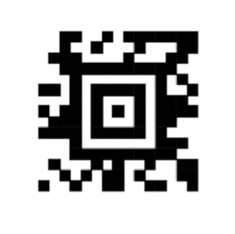

Форма кодировки — квадратная, так что соотношение сторон близко 1:1.

#### Data Matrix
имя для разметки: **"data_matrix"**  
Квадратный или прямоугольный двумерный штрихкод, который может закодировать большое количество информации. Часто используется в маркировке мелких объектов, таких как электронные компоненты.

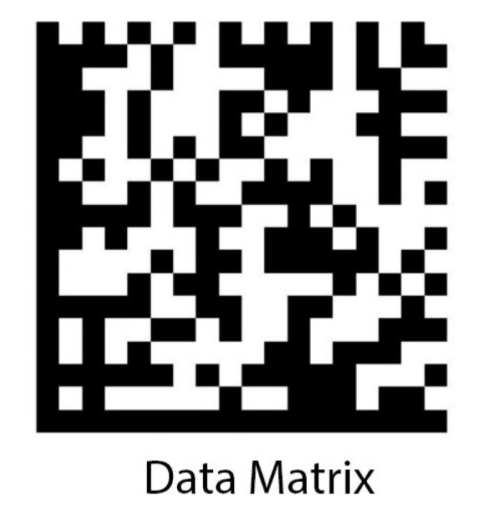

Также имеет квадратную или прямоугольную форму, поэтому соотношение сторон для квадратных символов составляет 1:1.

#### MaxiCode
имя для разметки: **"maxi_code"**  
Двумерный штрихкод, разработанный для высокоскоростного сканирования и используемый в основном в логистике и транспортных системах, особенно для почтовых и курьерских услуг.

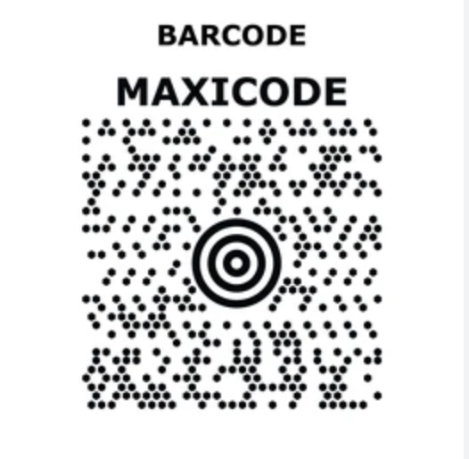

Максимальная кодовая зона круглая (гексагональная структура), и по существу имеет соотношение сторон 1:1, хотя визуально выглядит не как квадрат.

#### PDF417
имя для разметки: **"pdf_417"**  
Широкоформатный двумерный штрихкод, способный включать в себя большие объемы данных, такие как текстовые документы или фотографии. Применяется в удостоверениях, проездных билетах и документах.

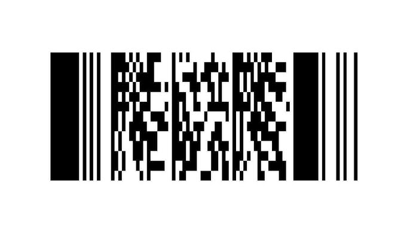

Этот штрихкод прямоугольной формы, соотношение ширины к высоте варьируется в зависимости от количества данных, обычно от 2:1 до 4:1.

#### QR
имя для разметки: **"qr"**  
Двумерный штрихкод, широко используемый благодаря своей высокой скорости сканирования и возможности хранения данных, таких как URL, контактная информация и прочее. Применяется в маркетинге, оплатах и прочих сферах.

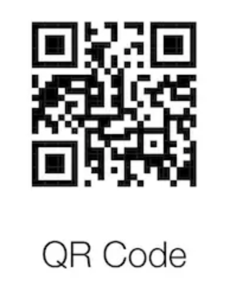

Квадратный штрихкод соотношение сторон 1:1.

### Смешанные:

#### Databar Expanded Stacked
имя для разметки: **"databar_expanded_stacked"**  
Гибридный штрихкод, который сочетает в себе плотность и компактность. Используется для маркировки фруктов, овощей и других товаров в розничной торговле, где требуется дополнительная информация, например, вес или цена.

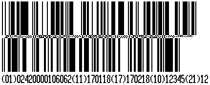

Соотношение сторон может быть гибким и зависит от количества строк и закодированных данных, но в сложенном виде может иметь более вытянутую прямоугольную форму. Обычно это около 3:1 или больше по ширине.

#### Databar Stacked

имя для разметки: **"databar_stacked"**

Сжатая версия штрихкода Databar. Это двухслойная структура, которая позволяет закодировать значительный объем данных на небольшом пространстве. Данный тип штрихкода часто применяется для свежих продуктов, таких как фрукты и овощи, где ограниченное пространство и необходимость динамического изменения информации (например, веса и цены) играют ключевую роль.

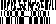

Соотношение сторон также гибкое, но учитывая особенности двухслойной структуры, может достигать более вытянутых и компактных форм, чтобы оптимально использовать небольшие пространства на упаковке. Обычно это около 3:1 или больше по ширине.

#### Databar Expanded

имя для разметки: **"databar_expanded"**  

Многозначный и гибкий штрихкод, созданный для кодирования большего объема информации, чем традиционные линейные штрихкоды. Он поддерживает кодирование как числовых, так и алфавитных данных, благодаря чему его можно использовать для передачи сложных наборов данных, включая информацию о продукте, дате истечения срока годности, номере партии и другом.
Его применение особенно ценно в цепочках поставок и розничной торговле, где требуется высокая емкость данных и возможность их динамического изменения. Databar Expanded позволяет включать идентификаторы приложений (AI), что улучшает управляемость информацией и поддерживает прослеживаемость продукции.

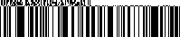

Соотношение сторон и ширина Databar Expanded динамически регулируются в зависимости от объемов кодируемой информации, предоставляя возможность для горизонтального растяжения. Обычно это около 4:1 или больше по ширине.
