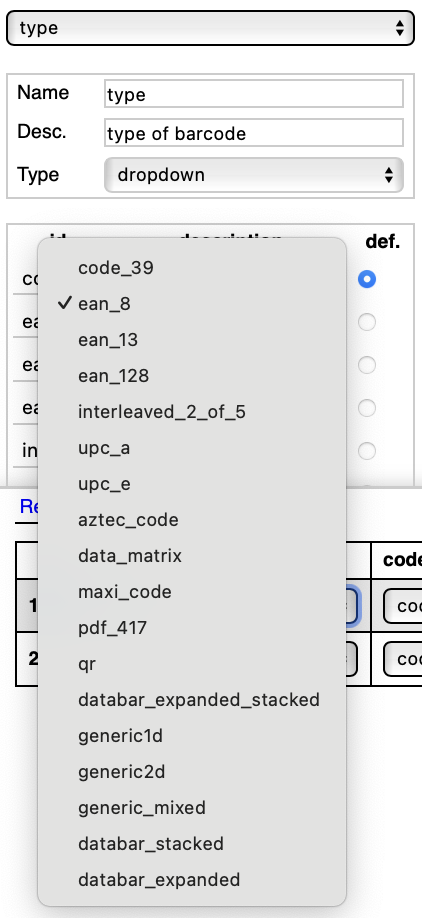

### Тут вся информация про разметку. При желании можете добавлять сюда атрибуты, которые вам нужны.

**Инструмент для разметки**: [VGG Annotator Version 2.0.12](https://www.robots.ox.ac.uk/~vgg/software/via/via_demo.html)

в помощь определитель типов штрихкодов - [ASPOSE](https://products.aspose.app/barcode/ru/recognize#)

**Проект с атрибутами**: Для одинаковой разметки возпользуйтесь файлом `example_barcode_annotator.json` и фотографией `example.png`. Загрузите их в аннотатор и все нужные атрибуты автоматически появятся. Если же вам хочется добавить еще какие-то атрибуты или что-то поменять, вы всегда можете написать в чат, где мы все обсудим. 

**Формат разметки:**  `json файл`

### Обязательные атрибуты:

**Полигон, где находится штрих-код**
Начало полигона - левая нижняя точка относительно эталонного представления штрих кода. Ориентация положительная. Точнее говоря, при обходе границы область должна оставаться слева.

**Тип штрих-кода**
[Подробнее тут](../BarcodeTypes/README.md)

*Атрибуты разметки типа:*

**Целостность штрих-кода**
Важно отличать штрих-коды, которые вообще ВОЗМОЖНО декодировать. Поэтому вот:

*Атрибуты разметки целостности:*

*Вообще я выделила еще штрих коды, которые размазаны сильно в класс unknown. Ибо они вроде и целые, но и почти наверное их нельзя будет распознать из-за качества штрих кода. Дальше разберемся, будем ли их выносить в отдельный класс. Поэтому ставьте `code is cutten off` только тем, кто обрезан настолько, что это помешает дальнейшей работе.*
